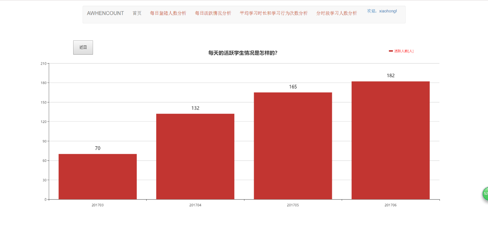
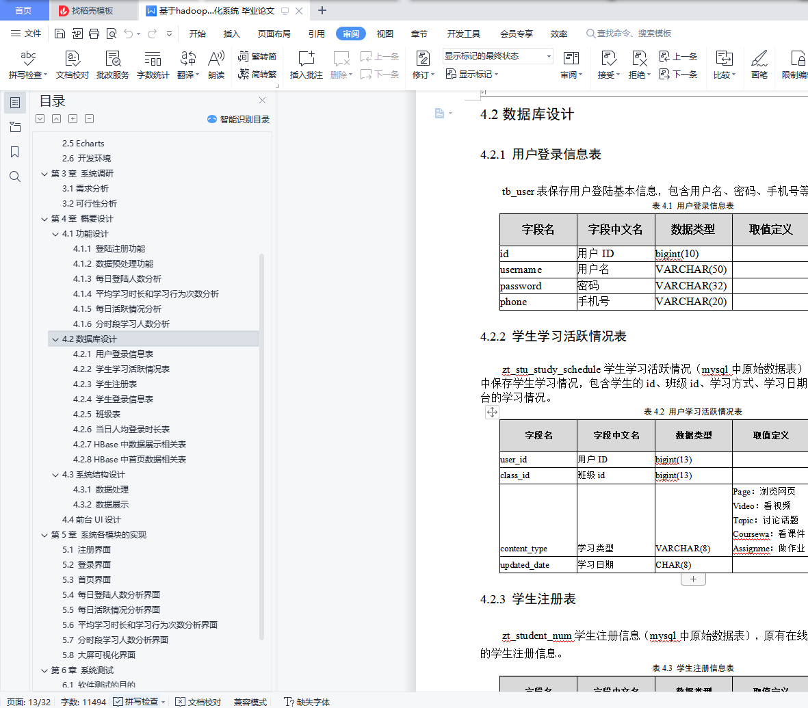

## 计算机毕业设计Hadoop+大模型在线教育大数据分析可视化 学情分析 课程推荐系统 机器学习 深度学习 人工智能 大数据毕业设计

## 要求
### 源码有偿！一套(论文 PPT 源码+sql脚本+教程)

### 
### 加好友前帮忙start一下，并备注github有偿Hadoop教育分析25
### 我的QQ号是2827724252或者798059319或者 1679232425或者微信:bysj2023nb 或bysj1688

# 

### 加qq好友说明（被部分 网友整得心力交瘁）：
    1.加好友务必按照格式备注
    2.避免浪费各自的时间！
    3.当“客服”不容易，repo 主是体面人，不爆粗，性格好，文明人。

​	
## 功能
研究或解决的问题
教育数据可视化系统设计与实现主要是Hadoop生态圈中MapReduce做分析与Hbase做存储，WEB端作数据展示，数据分析的维度有平台健康度，用户习惯分析等。系统解决的主要问题包括以下几点：
1．数据加载：数据的导入。
2．数据分析：包括每日登录人数分析、平均学习时长分析、学习行为次数分析、每日活跃情况分析和分时段学习人数分析。
3．数据呈现：可视化图表和仪表板的开发。
研究手段(途径)
教育数据可视化系统的设计与实现通过ECHATS+HADOOP进行开发和设计，开发语言选择是JAVA。研究途径主要是通过以下几个阶段来进行的。
第一阶段：开题 在做好需求分析的基础上，深入了解基于JAVA技术的Web网站的体系结构，熟悉ECHARTS的操作及通过JAVA代码操作HBASE; 
第二阶段：综合分析 完成网站的界面登录功能及将分析好的数据存储到HBASE数据库中，最后将网站与数据库连接使用ECHATS完成数据展示;
第三阶段：修改完善设计 在初步完成的基础上，查看所做设计是否完善，功能是否欠缺，后充实内容，各种操作能否达到预期效果。
第四阶段：完成设计，对完成的设计进行调试，并将代码部署至服务器;
第五阶段：完成相应系统的论文。

## 演示视频
https://www.bilibili.com/video/BV1goyRYbERw

## 演示截图

